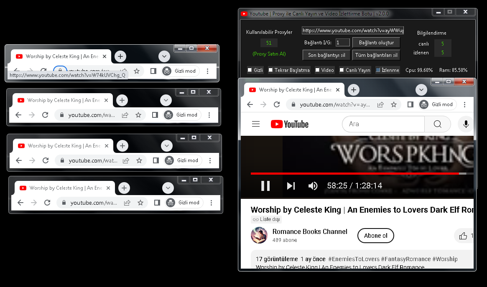

# YouTube Proxy Live Stream, Video and Shorts Viewer V2

## English : 

This project aims to develop a bot that automates live streaming and video watching on YouTube using proxies.

## Features

- Live stream, Shorts and video watching on YouTube using proxies
- Create and manage multiple connections
- Headless mode and auto-restart options
- Real-time monitoring of watching status, CPU, and RAM usage
- User-friendly interface

**Note:**
- Please replace `username` and `project-name` with your actual GitHub username and project name.
- Ensure the `requirements.txt` file is present in the project directory and updated with the necessary dependencies.
- Document the format and content of the `proxy_list.txt` file clearly for users to understand.

## Contributing
If you want to contribute, please create a pull request or open an issue. We appreciate your contributions!

## License
This project is licensed under the MIT License. For more information, see the LICENSE file.
----------------------------------------------------------------------------

## Türkçe Açıklama
 
Bu proje, proxy kullanarak YouTube'da canlı yayın, shorts ve video izleme işlemlerini otomatikleştiren bir bot geliştirmeyi amaçlamaktadır. 

## Özellikler

- Proxy kullanarak YouTube'da canlı yayın, Shorts ve video izleme
- Çoklu bağlantı oluşturma ve yönetme
- Gizli mod ve otomatik yeniden başlatma seçenekleri
- İzleme, CPU ve RAM kullanım bilgilerini anlık görüntüleme
- Kullanıcı dostu arayüz

**Not:**
- Lütfen `kullaniciadi` ve `proje-adi` kısımlarını kendi GitHub kullanıcı adı ve proje adı ile değiştirin.
- `requirements.txt` dosyasının proje dizininde mevcut olduğundan emin olun ve gerekli bağımlılıkları içerecek şekilde güncelleyin.
- `proxy_list.txt` dosyasının formatını ve içeriğini kullanıcıların anlayabileceği şekilde belgelemeyi unutmayın.

## Katkıda Bulunma
Katkıda bulunmak isterseniz, lütfen bir pull request oluşturun veya bir issue açın. Katkılarınızdan memnuniyet duyarız!

## Lisans
Bu proje MIT Lisansı ile lisanslanmıştır. Daha fazla bilgi için LICENSE dosyasına bakabilirsiniz.
